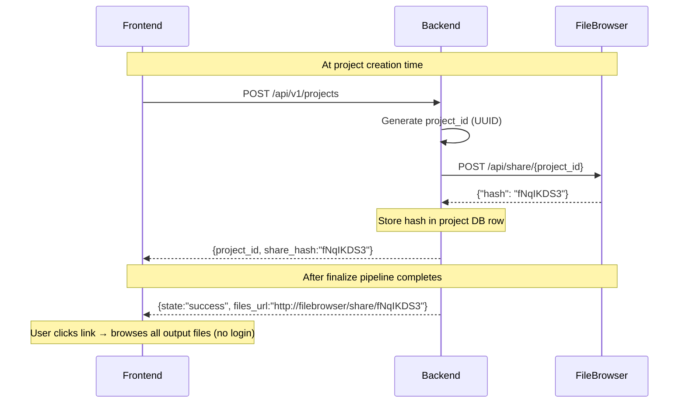

# FileBrowser Integration Plan

FileBrowser is an open-source web-based file manager. We use it to give users a clean, browsable link to their project output folder after finalize — no login required, no manual download links.

---

## What We Have Now

FileBrowser is already running as a Docker container:

```
Container: storage-filebrowser-1
Port:       8097 (host) → 80 (container)
Volume:     ./data/storage/projects → /srv  (inside container)
```

This means every project folder under `data/storage/projects/{project_id}/` is browsable through FileBrowser at `http://localhost:8097`.

---

## How Sharing Works

FileBrowser has a REST API. A share is created by POSTing to `/api/share/{path}` with a JWT token. The response returns a `hash` — a short random string that becomes the public share URL.

**Example flow (already tested manually):**

```bash
# 1. Get JWT token
TOKEN=$(curl -s -X POST http://localhost:8097/api/login \
  -H "Content-Type: application/json" \
  -d '{"username": "admin", "password": "..."}' )

# 2. Create share for a project folder
curl -X POST http://localhost:8097/api/share/4b034ba1-0309-4a7e-b10b-941b4816ebc8 \
  -H "X-Auth: $TOKEN" \
  -H "Content-Type: application/json" \
  -d '{}'
# Response: {"hash":"fNqIKDS3","path":"/4b034ba1-...","userID":1,"expire":0}

# 3. Public share URL (no login needed)
# http://localhost:8097/share/fNqIKDS3
```

`"expire": 0` means the link never expires.

---

## What Needs to Be Built

### 1. Persistent FileBrowser credentials in `.env`

```env
TCP_FILEBROWSER_BASE_URL=http://localhost:8097
TCP_FILEBROWSER_USERNAME=admin
TCP_FILEBROWSER_PASSWORD=...
```

### 2. New service: `code/app/services/filebrowser_client.py`

```python
import json
import urllib.request
from app.core.settings import settings

def _get_token() -> str:
    body = json.dumps({
        "username": settings.filebrowser_username,
        "password": settings.filebrowser_password,
    }).encode()
    req = urllib.request.Request(
        f"{settings.filebrowser_base_url}/api/login",
        data=body,
        headers={"Content-Type": "application/json"},
        method="POST",
    )
    with urllib.request.urlopen(req) as r:
        return r.read().decode()

def create_project_share(project_id: str) -> str:
    """Create a public share for the project folder. Returns the share hash."""
    token = _get_token()
    body = json.dumps({}).encode()
    req = urllib.request.Request(
        f"{settings.filebrowser_base_url}/api/share/{project_id}",
        data=body,
        headers={"Content-Type": "application/json", "X-Auth": token},
        method="POST",
    )
    with urllib.request.urlopen(req) as r:
        data = json.loads(r.read())
    return data["hash"]  # e.g. "fNqIKDS3"
```

### 3. Call it at project creation time

In `code/app/api/v1/projects.py` (or wherever `POST /projects` is handled), right after the project row is inserted into the DB:

```python
from app.services.filebrowser_client import create_project_share

project = create_project(db, ...)
share_hash = create_project_share(project.id)
project.share_hash = share_hash          # store in DB column
db.commit()
return {..., "share_hash": share_hash}
```

This creates the share immediately — even before any files exist in the folder. FileBrowser creates the share link for the path regardless of whether the folder has content yet.

### 4. Return the share URL in the finalize response

In `code/app/api/v1/finalize.py`, after the pipeline completes:

```python
files_url = f"{settings.filebrowser_base_url}/share/{project.share_hash}"
return {..., "files_url": files_url}
```

No extra FileBrowser API call needed at finalize — the hash already exists from project creation.

### 5. Show it in the frontend

After finalize polling resolves, display the share link:

```javascript
if (result.files_url) {
    $("finfo").innerHTML = `<a href="${result.files_url}" target="_blank">
        Browse all output files →</a>`;
}
```

---

## Architecture Diagram



---

## Docker Setup

FileBrowser runs from `data/storage/docker-compose.yaml` separately from the main stack. For production, it should be added to the main `docker-compose.hub.yml`:

```yaml
filebrowser:
  image: filebrowser/filebrowser
  ports:
    - "8097:80"
  volumes:
    - ./data/storage/projects:/srv
    - filebrowser_db:/database
  restart: unless-stopped
  networks:
    - drone_net
```

The backend container must be on the same Docker network so it can reach FileBrowser at `http://filebrowser:80` internally (no need to go through the host port).

---

## Notes

- Share hashes are stable — calling the share API a second time for the same path creates a new hash. If you want idempotent links, store the hash in the project DB after first creation and return it on subsequent requests.
- `expire: 0` = never expires. Pass `{"expire": <unix_timestamp>}` in the POST body to set a time limit.
- FileBrowser's `/srv` is mounted from `data/storage/projects`, which is the same directory the backend writes to. No file copying needed — files appear immediately after the pipeline writes them.
