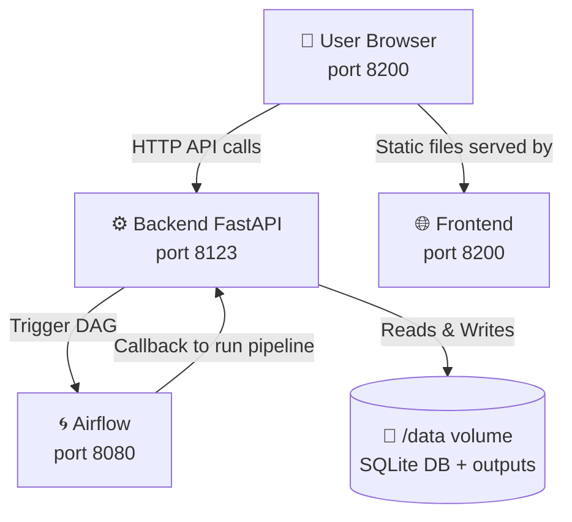
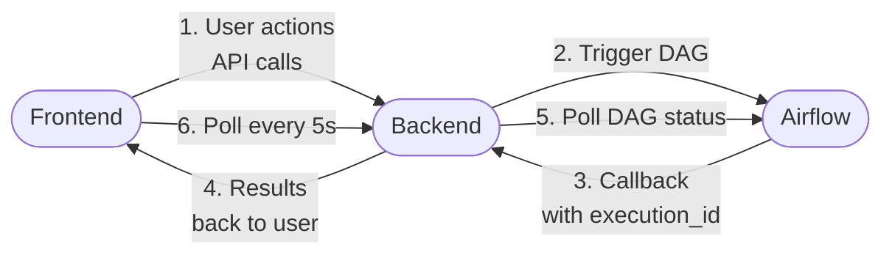
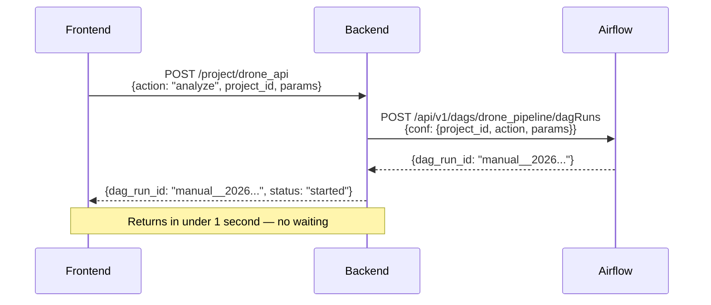
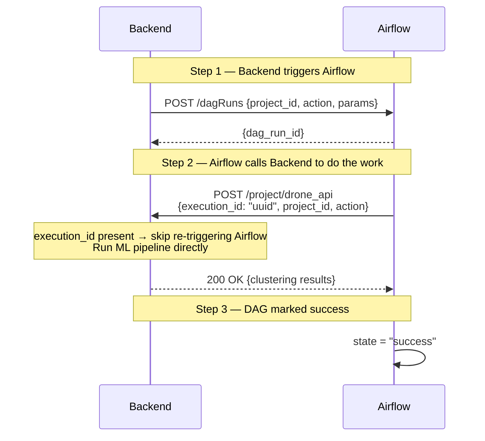
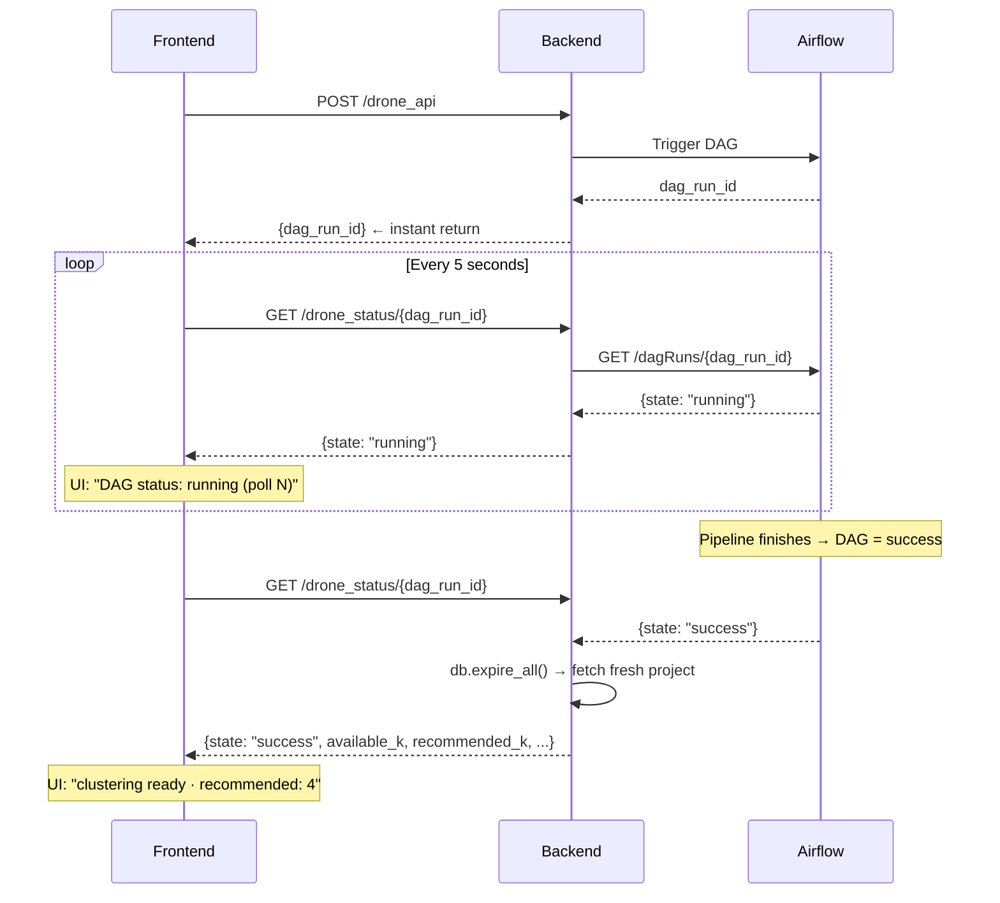
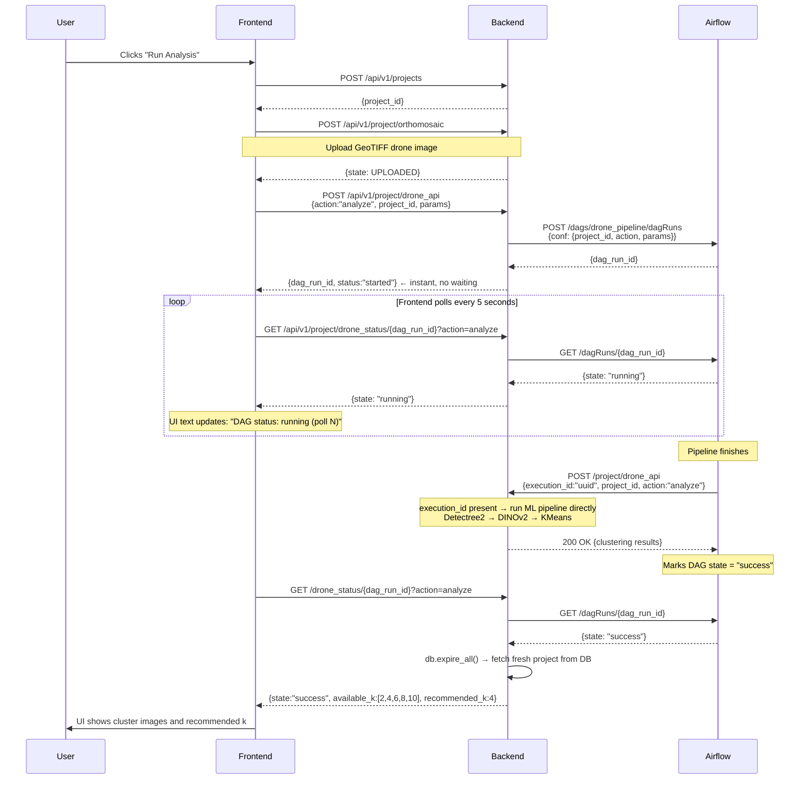
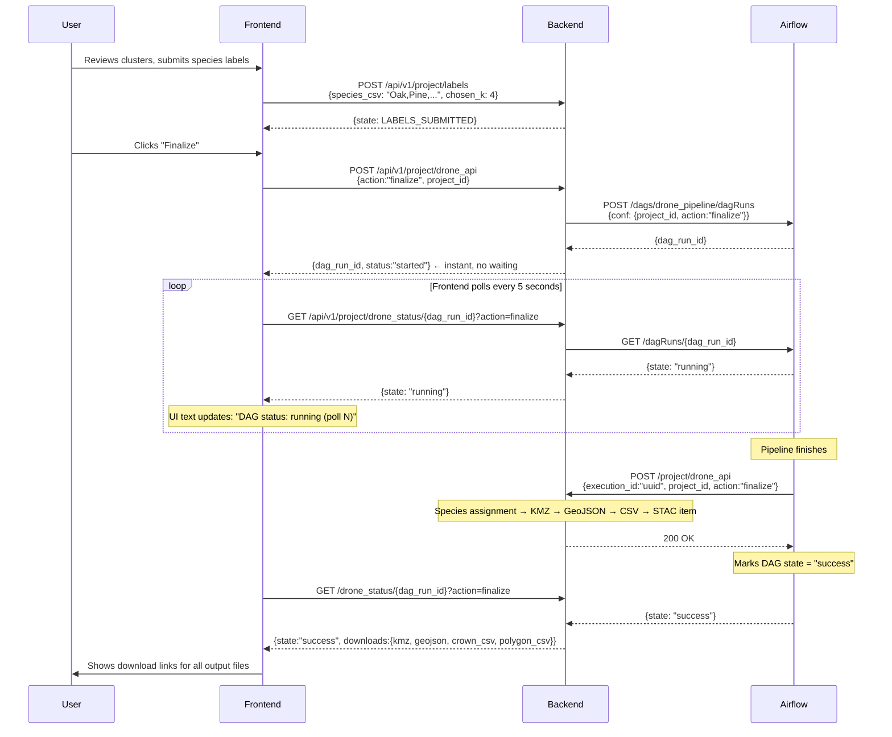
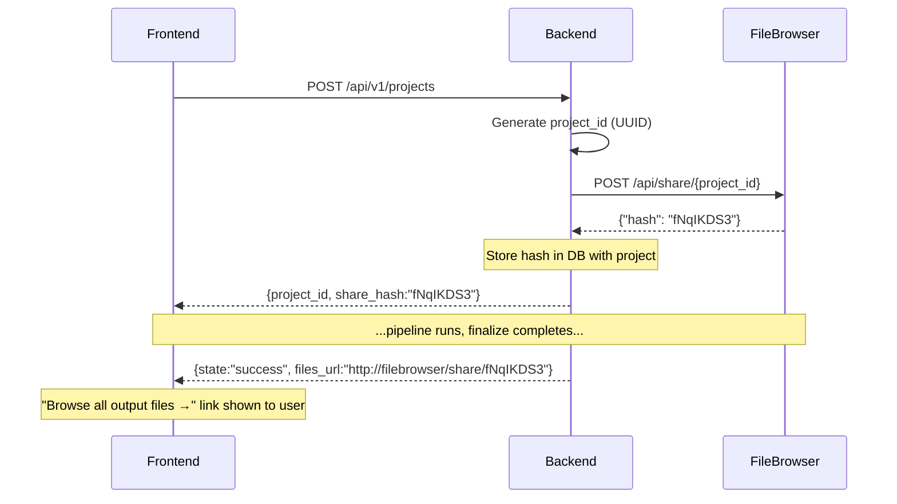

# Tree-Crown Pipeline — Implementation Progress

---

## 1. System Components

Three Docker containers work together:

**Frontend (port 8200)**
A single HTML page. Buttons for upload, analyze, label, finalize. Talks only to the backend — never directly to Airflow.

**Backend (FastAPI — port 8123)**
The brain. Receives requests from frontend, manages the database, talks to Airflow, and runs the ML pipeline when Airflow calls back. All business logic lives here.

**Airflow (external — port 8080)**
A job scheduler. Does zero ML computation. Its only job: receive a trigger from our backend, call our backend to run the pipeline, and track success or failure.



---

## 2. How the Three Parts Connect

**Frontend talks to Backend. Backend talks to Airflow. Airflow talks back to Backend.** The frontend never knows Airflow exists.



---

## 3. Full Pipeline

Create Project → Upload Orthomosic → Analyze → Build Cluster Table → Submit Label  Finalize and Export


**Analyze:** Detectree2 detects tree crowns → DINOv2 extracts visual features per crown → KMeans clusters similar crowns → user reviews cluster images and picks species labels.

**Finalize:** User submits labels → species assigned to every crown → exports KMZ (Google Earth), GeoJSON, CSV, STAC catalog entry.

---

## 4. Airflow Integration — How It Works

The backend connects to Airflow using environment variables in `.env`:

```
TCP_AIRFLOW_BASE_URL  →  URL of Airflow (internal Docker hostname)
TCP_AIRFLOW_USERNAME  →  admin
TCP_AIRFLOW_PASSWORD  →  admin
TCP_DRONE_DAG_ID      →  drone_pipeline
```

When `TCP_AIRFLOW_BASE_URL` is empty, the system runs the pipeline directly in-process — used for local development without needing Airflow at all.



---

## 5. The Callback Architecture

**Airflow is the manager. Our backend is the worker.**

- **Step 1** — Backend calls Airflow to START the job
- **Step 2** — Airflow calls our backend to DO the work (run the ML pipeline)
- **Step 3** — Backend returns result; Airflow marks DAG success or failed based on HTTP response code

Airflow has no idea what DINOv2 or KMeans is. It simply makes a POST to our backend and waits up to 2 hours for a response.



---

## 6. Polling — How the UI Stays Alive

**The problem:** ML pipeline takes 10–30 minutes. Browser drops HTTP connections after ~60–120 seconds. Holding one connection open for the full duration causes "Failed to fetch."

**The solution:** Break it into many short requests.

- **Trigger:** Frontend calls backend once → returns `dag_run_id` in under 1 second
- **Poll:** Frontend calls backend every 5 seconds → backend checks Airflow once → returns current state
- **Done:** When Airflow reports success, backend fetches fresh results from DB and returns full payload

Every individual request completes in under 1 second. No connection is held open. Browser never times out.



---

## 7. API Calls on Clicking Analyze



---

## 8. API Calls on Clicking Finalize



---

## 9. Bugs & Challenges

### Bug 1 — Circular Airflow Loop (two DAG runs triggered)

**What happened:** Every click of Analyze triggered two DAG runs instead of one.

**Why:** Airflow calls our backend's `drone_api` to run the pipeline. The backend saw that call, noticed Airflow was configured, and triggered Airflow again — infinite loop.

**Fix:** Added `execution_id` field. Airflow always sends it in its callback; the frontend never sends it. Backend checks — if `execution_id` is present, skip Airflow and run directly. One field, zero loop.

---

### Bug 2 — "Failed to fetch" on Frontend

**What happened:** Frontend showed "Failed to fetch" even though the pipeline was running correctly.

**Why:** Backend held one HTTP connection open for 10–30 minutes while polling Airflow internally. Browser TCP idle timeout (~60s) dropped the connection.

**Fix:** Changed architecture — backend returns `dag_run_id` immediately (under 1 second). Frontend polls a status endpoint every 5 seconds. Each poll completes in under 1 second. No connection is held long enough to time out.

---

### Bug 3 — `available_k` and `recommended_k` showing undefined

**What happened:** After pipeline succeeded, UI showed "clustering ready · recommended: undefined".

**Why:** SQLAlchemy caches DB objects in the session. The status endpoint read the project from the old cached version — before the pipeline had written the results.

**Fix:** Added `db.expire_all()` before reading the project on success. Forces SQLAlchemy to discard the cache and fetch fresh data from disk.

---

### Bug 4 — HuggingFace Async Client Crash

**What happened:** Pipeline crashed with "Cannot send a request, as the client has been closed" during DINOv2 feature extraction.

**Why:** HuggingFace Hub uses an async HTTP client to check for model updates. When called from a synchronous FastAPI endpoint, the async client was already closed.

**Fix:** Set `HF_HUB_OFFLINE=1` in environment variables. Model is already cached locally — no network check needed. Completely bypasses the async client.

---

## 10. Future Work

### FileBrowser Integration — Auto-Share Project Outputs

After finalize, users get individual download links for each file. The next step is to integrate [FileBrowser](docs/filebrowser_integration.md) — an open-source file manager running as a Docker container — so users get one browsable link to all their outputs.

**The key idea:** When a project is created (`POST /projects`), the backend immediately calls FileBrowser's API to create a permanent public share for that project's folder. FileBrowser returns a unique `hash` tied to that `project_id`. This hash is stored in the DB alongside the project. After finalize completes, the frontend constructs the share URL from this pre-generated hash and shows it to the user — no login required to browse or download files.



Each `project_id` gets its own unique hash — so every user gets an isolated, permanent link to only their project's files. No project can access another's outputs.

See [docs/filebrowser_integration.md](docs/filebrowser_integration.md) for the full technical plan and API calls.

---

### Frontend UX Improvements

The current frontend is a functional single-page app, but minimal. Planned improvements:
- Better progress display during long polling (step-by-step status messages)
- Visual cluster image gallery for reviewing KMeans results
- One-click download all outputs button via FileBrowser share link
- Mobile-friendly layout

---

### Centralized Logging

Currently each Docker container writes logs independently, viewable only via `docker logs`. Planned work:
- All containers (API, frontend, Airflow, pipeline workers) write to a shared external volume at `/var/logs/drone`
- Structured JSON log format so logs can be queried by project ID, user, timestamp
- Makes debugging across containers significantly easier — one place to look

---

### Google Single Sign-On

Currently the frontend has no authentication — anyone who knows the URL can use the system. Hridayansh has built Google SSO for the bioacoustics app. The plan is to reuse the same SSO mechanism:

- User signs in with Google before triggering any pipeline
- SSO returns: Google account, unique event ID, timestamp, auth key
- Every API call must include these parameters in headers
- Backend logs them so every pipeline run is traceable to a specific user and session

---

### Data Sharing Policy

Per professor's direction: all pipeline outputs (GeoJSON, CSVs, STAC items) should have a standardized sharing policy. When a user submits a compute request, they are asked:
- Are you okay making outputs publicly visible?
- What license applies to your data?
- Brief description of the survey

This information flows to a centralized data sharing service (likely CKAN-based) which sets external visibility on STAC items and handles data housekeeping (e.g. raw data cleanup after one month). This is a system to be designed across all drone, bioacoustics, and other apps — not just ours.
